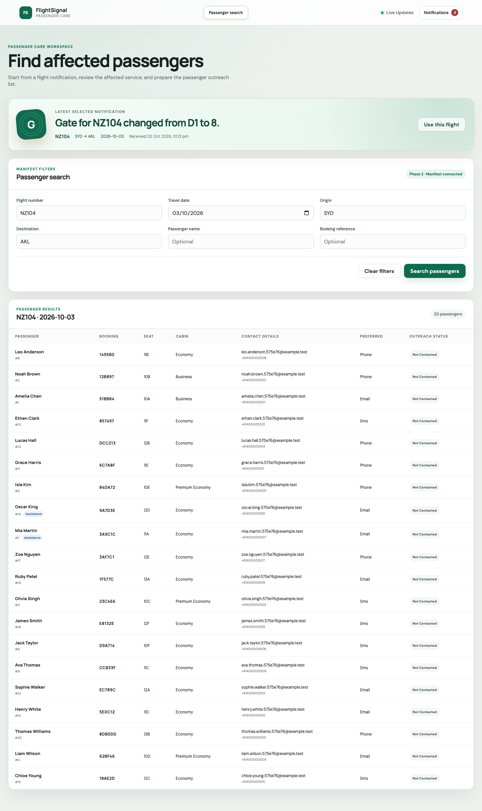
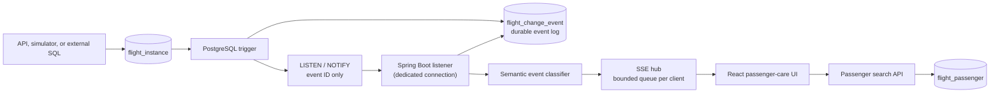
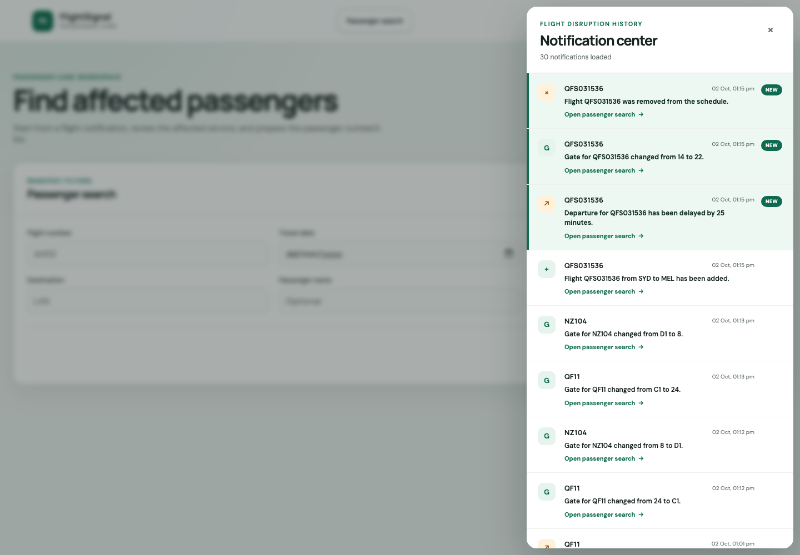

# FlightSignal

FlightSignal is a real-time flight disruption and passenger-care reference architecture built with PostgreSQL, Spring Boot 4, Java 25, Server-Sent Events, React, and Vite.

It detects committed `INSERT`, `UPDATE`, and `DELETE` operations on a flight table and turns technical row changes into business notifications. From there, an operator can open the list of passengers affected by a disruption in one step. There is no Kafka, SQS, or Redis: PostgreSQL is the system of record, the durable event log, and the wake-up signal.

> This is a portfolio/reference implementation, not an airline system. All passenger records are generated test data.



## Highlights

- **Transactional change capture.** A trigger writes each flight change to an append-only event table and sends `NOTIFY` in the same transaction. No-op updates are ignored.
- **Resilient listener.** It uses a dedicated LISTEN connection with a `SELECT 1` probe that detects half-open TCP connections. After any reconnect it catches up through every missed event.
- **Production-style SSE.** Each browser has a bounded queue and its own sender thread, so one slow client cannot stall the others. There is a per-instance connection limit. Replay uses `Last-Event-ID` plus a safety window for out-of-order commits. A client that is too far behind gets a `reset` instead of a burst.
- **Business-level events.** Notifications read like "Departure for QF11 has been delayed by 25 minutes. Gate changed from 12 to 31."
- **Passenger-care workflow.** The notification center leads into manifest search.
- **Continuous simulator.** It creates flights *with synthetic passenger manifests* and plays realistic disruption scenarios until you stop it.
- **Operability.** Flyway migrations, Actuator liveness and readiness probes, Prometheus metrics, JSON logs, RFC 9457 errors, event retention, and graceful shutdown.
- **Delivery tooling.** Multi-stage non-root container images, a one-command Docker Compose stack, GitHub Actions CI with Testcontainers, and Dependabot.

## Architecture



This is **trigger-based CDC**, not WAL/logical decoding. `NOTIFY` is only a low-latency wake-up signal. The `flight_change_event` table is the source of truth for replay and catch-up, and a scheduled job keeps it bounded.

Design details, sequence diagrams, delivery semantics, and a failure-mode analysis are in [docs/APP_INFORMATION.md](docs/APP_INFORMATION.md).

## User workflow

1. The workspace opens on the passenger-search form.
2. The first new flight event shows a disruption banner and loads the matching passengers automatically.
3. Later events show a toast and stay unread, so they never replace the flight currently being worked.
4. Selecting a notification makes it active, marks it read, and loads its manifest.
5. Operators can refine by route, passenger name, or booking reference.



## Quick start

### Option A: everything in Docker

Requires Docker only.

```bash
cp .env.example .env     # optional: adjust ports/credentials
make up                  # Postgres + API + web UI
make simulate            # in another terminal: live flights + passengers
```

Open [http://localhost:8080](http://localhost:8080). To run the simulator as a container too:

```bash
docker compose --profile app --profile sim up --build
```

### Option B: local development

Requires Java 25, Node.js 22.13+ (24 LTS recommended), Docker, and GNU Make. Maven is provided by the wrapper (`server/mvnw`).

```bash
make setup               # npm install + start PostgreSQL
make dev                 # Spring Boot (dev profile) + Vite
make simulate            # in another terminal
```

Open [http://localhost:5173](http://localhost:5173).

Java 25 is taken from `JAVA_HOME` or, on macOS, from `/usr/libexec/java_home -v 25`. You can override it with `make JAVA_25_HOME=/path/to/jdk-25 dev`.

Flyway creates the schema when the API starts. The `dev` profile also loads demo flights with 20 synthetic passengers each.

| Service | Address |
|---|---|
| React UI (dev) | `http://localhost:5173` |
| Web container | `http://localhost:8080` |
| Spring Boot API | `http://localhost:3101` |
| PostgreSQL | `localhost:5433` |

## Continuous simulator

```bash
make simulate                                   # runs until Ctrl+C
SIM_STEP_SECONDS=1 SIM_PASSENGERS=40 make simulate
make simulate-clean                             # remove all simulated data
```

Each cycle writes straight to PostgreSQL, bypassing the REST API, which shows that capture happens at the database boundary:

1. It creates a future flight on a realistic route **together with a synthetic passenger manifest, in one transaction**. The passengers therefore already exist when the "flight added" notification reaches the browser. Each manifest has cabins, seats, loyalty tiers, contact preferences, and occasional assistance needs.
2. It plays a random scenario such as delay → delay → boarding → departed → arrived, gate change → delay → removed, or delay → cancelled. Every step is committed separately, so it arrives as its own live notification.

| Variable | Default | Meaning |
|---|---|---|
| `SIM_STEP_SECONDS` | 3 | Pause between steps of one flight |
| `SIM_PAUSE_SECONDS` | 2 | Pause between flights |
| `SIM_PASSENGERS` | 24 | Base passengers per flight (randomised up to +50%) |
| `SIM_CYCLES` | 0 | Number of flights; 0 runs forever |

## API

| Method | Endpoint | Purpose |
|---|---|---|
| `GET` | `/api/flights` | Current flight instances |
| `POST` | `/api/flights` | Create a flight |
| `PATCH` | `/api/flights/{id}` | Update with optimistic concurrency (`version`) |
| `DELETE` | `/api/flights/{id}` | Remove a flight |
| `GET` | `/api/events?limit=30&before={id}` | Paginated, classified notification history |
| `GET` | `/api/events/stream?after={id}` | Replayable SSE stream (`flight-change`, `ready`, `reset`) |
| `GET` | `/api/passengers?flightNumber=QF11&travelDate=2026-10-03` | Manifest search with optional filters |
| `GET` | `/actuator/health/{liveness,readiness}` | Kubernetes-style probes |
| `GET` | `/actuator/prometheus` | Metrics, including `flightsignal_*` |

Errors are returned as RFC 9457 `application/problem+json`.

## Observability

| Metric | Meaning |
|---|---|
| `flightsignal_sse_clients` | Connected browsers on this instance |
| `flightsignal_events_delivery_lag_seconds` | Database commit to SSE fan-out |
| `flightsignal_events_broadcast_total` | Events fanned out |
| `flightsignal_sse_clients_closed_total{reason}` | Disconnects, including `slow_consumer` |
| `flightsignal_sse_clients_rejected_total` | Connections refused at the limit |
| `flightsignal_listener_connected` | 1 while the LISTEN connection is healthy |
| `flightsignal_listener_reconnects_total` | Listener reconnect attempts |
| `flightsignal_events_purged_total` | Events deleted by retention |

The `prod` profile (used by the container image) writes ECS JSON logs.

## Test and build

```bash
make test      # backend unit tests + frontend lint and tests
make verify    # + Testcontainers integration tests (needs Docker)
make build     # API jar + web bundle
```

CI (`.github/workflows/ci.yml`) runs four jobs on every push and pull request:

- Backend `verify`, including Testcontainers.
- Frontend lint, test, and build.
- A database and simulator smoke test.
- Container image builds, pushed to GHCR from `main`.

## Project structure

```text
.github/   CI workflow and Dependabot
db/        Continuous simulator (development only)
docs/      Architecture documentation and screenshots
scripts/   Simulator runner
server/    Spring Boot API, Flyway migrations, listener, classifier, SSE hub, tests, Dockerfile
web/       React app, tests, Dockerfile, nginx configuration
```

The **Flight operations** page (add, delay, cancel, or remove flights from the UI) is hidden in the portfolio build. Enable it with `VITE_SHOW_FLIGHT_OPERATIONS=true` in `web/.env.local`, or as a Docker build argument.

## Production limitations

- No authentication or authorization yet: every connected browser receives every event, and passenger data is unprotected. This is the main blocker for real use.
- Passenger PII would need data minimisation, encryption, access auditing, and retention policies.
- PostgreSQL backup/restore and HA, edge rate limiting, tracing, dashboards, and alerts are not included.
- Delivery is at-least-once with client de-duplication. Strict cross-transaction ordering is not guaranteed (see the delivery semantics in the docs).
- Notification read state is per browser.

## Security and sample data

- Passenger names, booking references, e-mail addresses (on the reserved `example.test` domain), and phone numbers are synthetic.
- Default credentials in `.env.example` and `docker-compose.yml` are for local use only.
- Containers run as non-root users. The web server sends a strict Content-Security-Policy and other security headers.
- Environment files, build outputs, and common secret formats are excluded by `.gitignore`.

## License

Released under the [MIT License](LICENSE).
