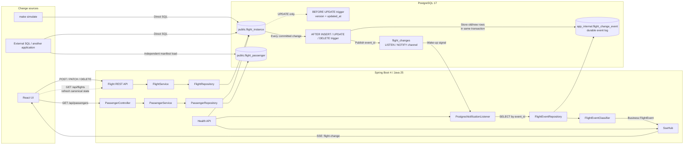
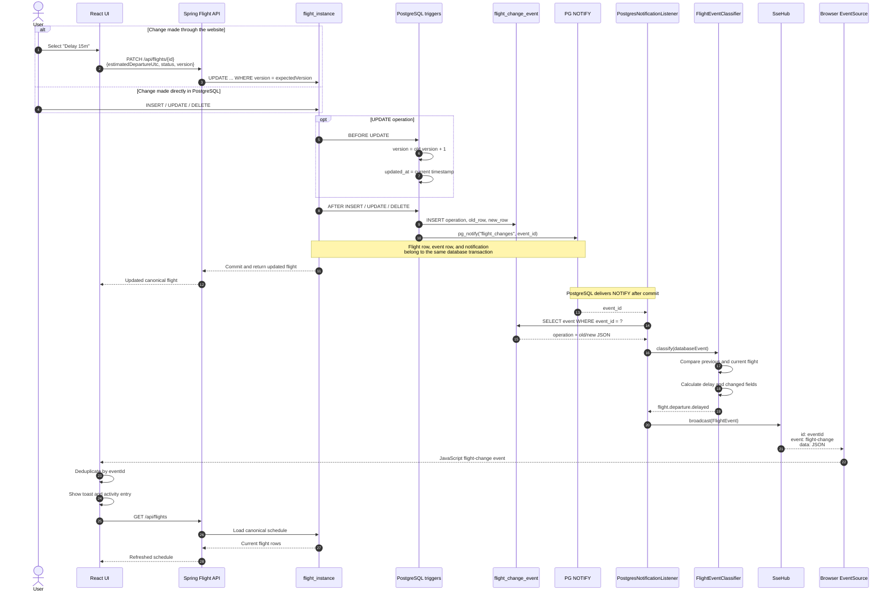
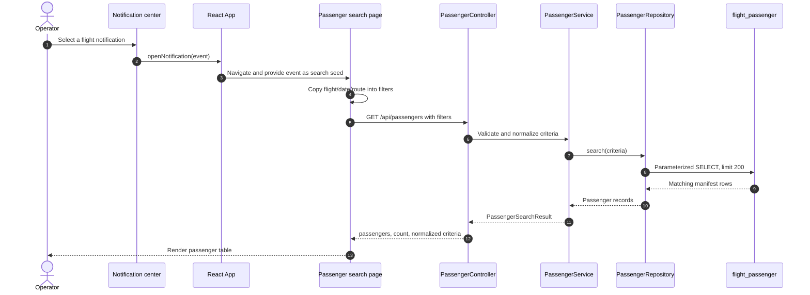

# Flight Notification Application

## Document information

| Property | Value |
|---|---|
| Application | CDC SSE Flight Notifications / FlightSignal |
| Purpose | Publish real-time UI notifications when flight rows are inserted, updated, or deleted in PostgreSQL |
| Architecture style | Trigger-based change data capture with a transactional outbox and Server-Sent Events |
| Backend | Spring Boot 4.1.1, Java 25, Spring MVC, Spring JDBC |
| Frontend | React, Vite |
| Database | PostgreSQL 17 |
| Message broker | None; PostgreSQL `LISTEN/NOTIFY` provides the wake-up signal |
| Data classification | Synthetic development data only; no real passenger records |
| License | MIT |
| Last updated | 2026-10-02 |
| Status | Working reference implementation (portfolio-grade: CI, containers, observability) |

## Table of contents

1. [Executive summary](#executive-summary)
2. [Design goals](#design-goals)
3. [Overall system architecture](#overall-system-architecture)
4. [Data model and date-time design](#data-model-and-date-time-design)
5. [Sequential event flow](#sequential-event-flow)
6. [SSE connection and replay flow](#sse-connection-and-replay-flow)
7. [Event classification](#event-classification)
8. [Delivery semantics](#delivery-semantics)
9. [Failure and recovery analysis](#failure-and-recovery-analysis)
10. [Code and class responsibilities](#code-and-class-responsibilities)
11. [API reference](#api-reference)
12. [Development and operations](#development-and-operations)
13. [Testing](#testing)
14. [Production hardening recommendations](#production-hardening-recommendations)
15. [Passenger-care Phase 2](#passenger-care-phase-2)

## Executive summary

The application detects every `INSERT`, `UPDATE`, and `DELETE` made to the PostgreSQL flight table and sends a business-readable notification to connected web browsers in real time.

PostgreSQL is used as:

- The system of record for current flight data.
- The durable event log for flight changes.
- The low-latency signalling mechanism through `LISTEN/NOTIFY`.

Spring Boot listens for PostgreSQL notifications, loads the durable event, classifies the raw row change into a business event, and broadcasts it to React using Server-Sent Events (SSE). The implementation does not require Kafka, SQS, RabbitMQ, or another messaging component.

The React application also includes a notification center and a passenger-care workspace. Operators can reopen any loaded notification, carry its flight context into a passenger-search form, and see new live disruptions as a prominent banner. Selecting a notification automatically submits the flight search and displays matching passenger contact details from PostgreSQL.

This is trigger-based change data capture, not PostgreSQL WAL/logical-decoding CDC. It is intentionally scoped to the `flight_instance` table.

The delivery model is:

> Transactionally captured, at-least-once delivery with replay (or a history reset beyond the replay limit) and client-side deduplication.

It is not exactly-once delivery. See [Delivery semantics](#delivery-semantics) for the out-of-order commit window.

## Design goals

- Detect changes regardless of whether they come from the Spring API, a SQL script, or another database client.
- Keep flight-state changes and event creation atomic.
- Avoid an external messaging platform.
- Provide low-latency, one-way server-to-browser notifications.
- Preserve enough data to explain what changed and generate useful messages.
- Recover from short database, listener, network, and browser disconnections.
- Keep the React UI synchronized with the canonical state in PostgreSQL.
- Let passenger-care operators move from a flight disruption to the affected manifest with one action.
- Keep passenger data independently populated; flight CDC does not create or modify passenger records.

## Overall system architecture



### Why the design uses both an event table and `NOTIFY`

`LISTEN/NOTIFY` is not treated as a durable queue. A PostgreSQL notification can be missed while an application listener is disconnected.

The durable data is therefore stored in `app_internal.flight_change_event`. The notification contains only the generated event ID and acts as a low-latency wake-up signal.

The processing pattern is:

1. The database trigger writes the complete change event into `flight_change_event`.
2. The trigger publishes the generated `event_id` with `pg_notify`.
3. PostgreSQL delivers the notification after the transaction commits.
4. Spring receives the event ID and queries the durable event row.
5. Spring classifies and publishes the event to connected browsers.
6. If a notification is missed, the listener's catch-up pages through the event table after reconnecting.

This is a transactional outbox pattern contained entirely inside PostgreSQL.

### Main responsibilities

| Component | Responsibility |
|---|---|
| `public.flight_instance` | Current authoritative state of each flight |
| `public.flight_passenger` | Searchable passenger manifest snapshot for each flight |
| `app_internal.flight_change_event` | Durable history of row changes |
| PostgreSQL triggers | Atomically capture every flight-row mutation |
| PostgreSQL `LISTEN/NOTIFY` | Low-latency signal containing an event ID |
| Spring notification listener | Consume notification IDs and retrieve durable events |
| Event classifier | Convert technical row changes into business events |
| SSE hub | Manage browser streams, replay, buffering, heartbeats, and broadcast |
| React event hook | Reconnect, deduplicate, maintain activity history, and refresh flights |
| Passenger search API | Validate flight filters and return matching manifest records |

## Data model and date-time design

### `public.flight_instance`

This is the canonical flight table. Its main fields are:

- `flight_id`: UUID primary key.
- `carrier_code` and `flight_number`: form the displayed flight code, such as `AA112`.
- `service_date`: the operational service date.
- `origin_airport` and `destination_airport`: three-letter airport codes.
- `origin_timezone` and `destination_timezone`: IANA timezone names.
- Scheduled, estimated, and actual UTC departure timestamps.
- Scheduled, estimated, and actual UTC arrival timestamps.
- `status`: scheduled, delayed, boarding, departed, arrived, or cancelled.
- `gate`: optional gate identifier.
- `version`: optimistic-concurrency version.
- `created_at` and `updated_at`: audit timestamps.

The table has database constraints for supported statuses, different origin/destination airports, and unique flight instances.

### `public.flight_passenger`

This table holds the passenger manifest used by the passenger-care workflow. It is intentionally separate from the flight CDC pipeline because, in the target system, a different application owns and populates this data.

Its main fields are:

- `passenger_id`: UUID primary key.
- `flight_id`: optional foreign key to `flight_instance`, using `ON DELETE SET NULL`.
- Copied flight identity: carrier, flight number, service date, origin, and destination.
- `manifest_sequence`: stable position used to make sample seeding repeatable.
- Passenger identity and contact fields: given name, family name, email, and phone.
- Operational fields: booking reference, seat, cabin, loyalty tier, preferred contact method, special-assistance flag, and contact status.
- `created_at` and `updated_at`: audit timestamps.

The copied flight identity deliberately remains after the related flight is deleted. This lets an operator still find the manifest from a historical removal notification even though `flight_id` has become null. A unique constraint on `(flight_id, manifest_sequence)` makes the sample generator idempotent, and search indexes cover flight/date/route and passenger name.

### UTC and local date-time handling

The database stores the canonical instant as `timestamptz` and stores the applicable IANA timezone separately. It does not persist a second `departureLocalDateTime` column.

For example:

```text
scheduled_departure_utc = 2026-10-02T01:00:00Z
origin_timezone         = Australia/Sydney
```

React derives the Sydney-local display time with `Intl.DateTimeFormat` using `Australia/Sydney`.

This avoids UTC and local timestamps drifting apart and allows daylight-saving changes to be handled by timezone rules. UTC remains the canonical instant; the timezone controls how it is presented locally.

One current limitation is that the add-flight form interprets an HTML `datetime-local` value using the browser's timezone before converting it to UTC. If the browser timezone differs from the flight origin, the conversion may be incorrect. A production version should resolve a supplied local date/time together with its origin timezone on the backend.

### `app_internal.flight_change_event`

This is the durable event/outbox table. It stores:

- Generated `event_id`.
- Database operation: `INSERT`, `UPDATE`, or `DELETE`.
- Affected `flight_id`.
- Complete previous row as JSONB when applicable.
- Complete new row as JSONB when applicable.
- Event occurrence timestamp.

Storing complete old and new row images allows the backend to determine the business meaning of a change rather than only reporting that a row changed.

## Sequential event flow

The following sequence shows a delay update. The same trigger and delivery path handles flight creation, cancellation, gate changes, other status changes, and deletion.



### Transaction boundary

The business-row change, outbox insert, and call to `pg_notify` execute in the same PostgreSQL transaction.

- If the transaction commits, the flight change and durable event both exist, and the notification is delivered.
- If the transaction rolls back, the flight change and event row both disappear, and no notification is delivered.
- If the trigger cannot create the event, the business change fails. This intentionally favours consistency over availability.

The current REST mutations each execute as a single JDBC statement and therefore as a single autocommit transaction. If future operations require multiple SQL statements to form one business change, the corresponding service method should be annotated with `@Transactional`.

### Notification-to-passenger lookup flow



The existing **Use this flight** button executes the same search again. Operators can also refine passenger name or booking reference and submit manually. A request sequence guard prevents a slower, older response from overwriting a newer search in the browser.

## SSE connection and replay flow

When the React page opens:

1. `useFlightEvents` requests the 30 most recent events. If that request fails it retries with exponential backoff; the stream is **never** opened without a cursor, so old events can never be replayed as if they were new.
2. It records the highest received `eventId` as its cursor.
3. It opens `/api/events/stream?after={eventId}`.
4. Spring registers an `SseClient` **before** querying missed events. From this moment live events are queued for the client, which closes the race between the history query and the start of live delivery.
5. Spring loads the replay: every event newer than the cursor plus a small *safety window* of event IDs at or below it (default 20, see [Delivery semantics](#delivery-semantics)).
6. If more than `app.sse.replay-limit` events (default 500) are newer than the cursor, Spring sends a `reset` event instead of an unbounded burst. The browser then reloads its history page.
7. Otherwise the replayed events are sent, followed by a `ready` event carrying an SSE `retry:` hint.
8. The client's dedicated virtual thread then drains its queue, skipping events already sent during replay.
9. Without any cursor (no `Last-Event-ID`, no `after`), nothing is replayed.

An SSE event is formatted as:

```text
id: 12
event: flight-change
data: { ...FlightEvent JSON... }
```

The browser remembers the SSE `id`. After a transient network interruption native `EventSource` reconnects and sends `Last-Event-ID`; the server uses the greater of that value and the `after` query parameter as the cursor. If the browser gives up (for example the API returned `502`/`503` while restarting, which permanently closes an `EventSource`), the hook reconnects manually with backoff and also retries immediately when the browser reports it is back `online`.

The browser de-duplicates by `eventId`. Events it already knows (for example the safety-window replay) are merged silently and never raise a second toast.

The server also:

- Queues a heartbeat comment every 20 seconds, which also detects disconnected browsers.
- Uses a 30-minute emitter timeout, after which `EventSource` reconnects and resumes from its last ID.
- Limits each instance to `app.sse.max-clients` connections (default 500). Further connections receive `503` with `Retry-After`.
- Gives every client a bounded queue (`app.sse.client-queue-capacity`, default 256). A client that falls that far behind is disconnected as a slow consumer; it reconnects and catches up through replay without delaying other browsers.
- Sends `Cache-Control: no-store` and `X-Accel-Buffering: no`, and disables HTTP compression. The bundled nginx configuration disables proxy buffering for the stream.
- Completes all streams before the web server's graceful-shutdown phase, so browsers reconnect to another instance immediately.

## Event classification

The event classifier evaluates changes in priority order:

1. `flight.added`
2. `flight.removed`
3. `flight.cancelled`
4. `flight.departure.delayed`
5. `flight.departure.revised` when moved earlier
6. `flight.schedule.changed`
7. `flight.gate.changed`
8. `flight.status.changed`
9. `flight.updated`

Cancellation is intentionally checked before delay. If a single update both cancels the flight and changes its estimated departure, the user receives the more important cancellation message.

### Delay calculation example

Original values:

```text
scheduled departure = 01:00 UTC
estimated departure = 01:00 UTC
status              = SCHEDULED
```

Updated values:

```text
estimated departure = 01:25 UTC
status              = DELAYED
```

The classifier calculates:

```text
additional delay = new effective departure - old effective departure
                 = 25 minutes

total delay      = new effective departure - scheduled departure
                 = 25 minutes
```

It produces a public event similar to:

```json
{
  "eventId": "12",
  "operation": "UPDATE",
  "type": "flight.departure.delayed",
  "severity": "warning",
  "message": "Departure for AA112 has been delayed by 25 minutes.",
  "delay": {
    "additionalDelayMinutes": 25,
    "totalDelayMinutes": 25,
    "previousDepartureUtc": "2026-10-02T01:00:00Z",
    "newDepartureUtc": "2026-10-02T01:25:00Z"
  }
}
```

The public `FlightEvent` also contains the current flight, previous flight, database operation, event timestamp, changed fields, semantic type, and severity.

## Delivery semantics

### Guarantees provided

- A flight-table mutation cannot commit without its durable event row.
- Notifications are only delivered for committed transactions.
- An `UPDATE` that changes nothing produces no event and does not bump `version`.
- Events have stable IDs; a browser may receive one more than once, and de-duplicates it.
- Listener outages of any length are recovered: after reconnecting, the listener pages through every event above its high-water mark.
- Browser outages are recovered by replay up to `replay-limit` events, and beyond that by a `reset` that reloads history.
- A direct SQL change uses the same event flow as an API change.
- A slow browser cannot delay delivery to other browsers.

### Out-of-order commits

`event_id` comes from an identity column. A transaction can take ID 10, a second one take 11 and commit first, and the first commit afterwards. A browser that received 11 and then reconnected with `Last-Event-ID: 11` would never see 10 if replay started strictly after 11. To cover this, replay starts `replay-safety-window` IDs **below** the cursor, and the listener's catch-up starts `reconcile-window` IDs below its high-water mark. Both sides de-duplicate. A transaction that stays open longer than the window can still be missed by a reconnecting browser; strict global ordering would need a commit-order sequence (for example logical decoding), which this design intentionally avoids.

### Guarantees not provided

- Exactly-once delivery.
- Strict global commit ordering between concurrent transactions.
- Acknowledgements from browsers or durable per-browser subscriptions.
- High availability for PostgreSQL.

The effective model is at-least-once with client-side de-duplication.

## Failure and recovery analysis

No finite implementation can enumerate every infrastructure failure. The following matrix covers the meaningful failure modes in the current topology and code.

| Failure point | Current behaviour and recovery | Coverage |
|---|---|---|
| Invalid flight request | `FlightRules` validates codes, statuses, dates, gates, and IANA time zones (malformed zone IDs included). Database constraints provide a second layer. Errors are RFC 9457 problem details. | Handled |
| Duplicate flight instance | PostgreSQL unique constraint rejects it; `ApiErrorHandler` returns HTTP `409`. | Handled |
| Two clients update the same flight | PATCH uses `WHERE version = expectedVersion`. The losing request receives HTTP `409` and must refresh. | Handled |
| Direct SQL bypasses API validation | Database constraints still enforce status, route, and uniqueness, but do not duplicate every service-level rule. | Partial |
| Flight transaction rolls back | Flight row, event row, and `NOTIFY` roll back together. No false notification is produced. | Handled |
| Trigger cannot write the event | The complete business transaction fails, preventing an untracked flight change. | Handled |
| Spring is down when a change occurs | The event remains in `flight_change_event` and can be replayed after restart. | Bounded recovery |
| `NOTIFY` is missed while disconnected | The durable event remains. After reconnecting, the listener pages through every event above its high-water mark (minus a window for out-of-order commits). | Handled |
| PostgreSQL listener connection drops | Detected by the driver, or within `socket-timeout` by the periodic `SELECT 1` probe for half-open TCP connections. The listener reconnects with exponential backoff from 1 to 30 seconds, and readiness reports DOWN meanwhile. | Handled |
| PostgreSQL restarts | The JDBC listener reconnects. The Docker volume preserves rows. There is no database HA or backup strategy yet. | Partial |
| Duplicate notification or replay | The listener remembers 10,000 delivered IDs, the SSE client skips events already replayed, and React ignores IDs it already knows. | Handled |
| Browser network connection drops | Native `EventSource` reconnects and sends `Last-Event-ID`. If it gives up (non-200 response), the hook reconnects with backoff and on the browser's `online` event. | Handled |
| Browser reconnects after missed events | Up to `replay-limit` (500) events are replayed. Beyond that the server sends `reset` and the browser reloads history. | Handled |
| Event arrives while SSE history is replaying | The client is registered first. Live events queue up and are sent after the replay, skipping duplicates. | Handled |
| Idle proxy closes SSE | A heartbeat comment is sent every 20 seconds, and EventSource reconnects after closure. | Mostly handled |
| Reverse proxy buffers SSE | The response disables caching and compatible proxy buffering, and compression is disabled. Production proxy configuration is still required. | Partial |
| Browser remains open longer than the SSE timeout | The emitter expires after 30 minutes; EventSource creates a new stream and resumes from its last ID. | Handled |
| Dead browser client | Detected on the next write (heartbeat at most 20 seconds later). Completion, timeout, error, and failed-write paths remove the client. | Handled |
| Spring shuts down | Graceful shutdown. `SseHub` completes every stream first so browsers reconnect elsewhere, then the listener connection is closed and its thread joined. | Handled |
| REST/database call fails in React | The UI displays an error banner with a Retry action. SSE displays a reconnecting state. | Handled |
| Invalid passenger search | `PassengerService` requires a valid flight code and travel date and validates optional airport codes. `ApiErrorHandler` returns HTTP `400`. | Handled |
| Passenger query returns no records | The UI displays an explicit empty state while retaining the submitted filters. | Handled |
| Passenger query fails | The UI clears stale results and shows an error with a Retry action. | Handled |
| Passenger searches complete out of order | Each search is an immutable query object; only the result tagged with the current query ID is shown. | Handled |
| Flight is deleted after the manifest is loaded | The passenger foreign key becomes null, but copied flight identity remains searchable from the historical notification. | Handled by schema |
| Passenger source application is late or unavailable | Flight notifications still work, but passenger search may be empty or stale. No freshness SLA or source reconciliation exists yet. | External dependency gap |
| Passenger result exceeds 200 rows | The repository currently limits results to 200 without pagination. | Gap |
| Passenger data is accessed by an unauthorized user | Authentication, authorization, audit logging, masking, and field-level access controls are not implemented. | Production blocker |
| Invalid PostgreSQL notification payload | Invalid event IDs are ignored and logged. | Handled |
| Malformed event JSON or incompatible schema | Classification can throw. The event is not marked delivered and the listener reconnects and retries it. There is no poison-event isolation yet. | Gap |
| More than 500 events occur while a browser is offline | The server sends `reset` instead of replaying, and the browser reloads its newest history page. | Handled |
| Many events occur while the listener is disconnected | Catch-up pages through all of them. | Handled |
| Event table grows indefinitely | A daily retention job deletes events older than 30 days (configurable) in batches. | Handled |
| Large burst of changes | Broadcast only enqueues. Each client drains its own queue on its own virtual thread. The hidden Flight Operations page reloads once per event. | Mostly handled |
| Slow SSE client | Bounded per-client queue. On overflow the client is disconnected (metric `flightsignal.sse.clients.closed{reason=slow_consumer}`) and catches up by replay. There is a per-instance connection limit with `503` + `Retry-After`. | Handled |
| Multiple Spring instances | PostgreSQL fans notifications out to each listener. Each instance serves its own connected browsers, but event queries are duplicated. | Supported |
| Concurrent transactions commit out of ID order | Replay and catch-up re-check a window of IDs below the cursor, and clients de-duplicate. Strict global ordering is still not guaranteed. | Mitigated |
| Privileged session disables/bypasses triggers | No event is captured. Production roles must not be permitted to disable triggers or bypass them. | Operational control required |
| Database schema changes | Versioned Flyway migrations run at start-up. Existing databases are baselined. | Handled |
| Unauthorized API use | Authentication, authorization, row-level security, and rate limiting are not implemented. | Gap |
| Monitoring failure | Actuator liveness and readiness probes, a listener health indicator, and Prometheus metrics for clients, broadcasts, delivery lag, reconnects, drops, and purges. Dashboards and alerts are still to be built. | Mostly handled |
| Development port is occupied | `concurrently -k` stops Vite when the API process fails. | Handled |
| Browser timezone differs from origin timezone | Current form conversion may create the wrong UTC instant from a local input. | Gap |
| SQL update supplies values identical to current values | The BEFORE trigger leaves the row untouched, so `version` is unchanged and no event is captured. | Handled |
| API caller needs to clear a nullable PATCH field | Null currently means “not supplied,” so fields such as `gate` cannot be explicitly cleared. | Gap |
| DELETE races with UPDATE | DELETE does not currently require an expected version. | Gap |
| Code regression | Unit tests for the classifier, replay, SSE hub/client, validation, and UI hook, plus Testcontainers end-to-end tests and a simulator smoke test, all run in CI. | Handled |

## Code and class responsibilities

### Application bootstrap and configuration

#### `FlightNotificationApplication`

Main Spring Boot entry point. It enables auto-configuration, configuration-property scanning, and scheduling (SSE heartbeats and event retention).

#### `SseProperties`, `ListenerProperties`, `RetentionProperties`

Type-safe records for `app.sse.*`, `app.listener.*`, and `app.events.retention.*`, each with defaults so the application starts with an empty configuration. See `application.yml` for every setting and its meaning.

#### `application.yml`

Configures the HTTP port, graceful shutdown, the PostgreSQL connection and Hikari pool, Flyway, virtual threads, RFC 9457 problem details, SSE delivery limits, listener timeouts, event retention, and Actuator endpoints. Two profiles add behaviour:

- `dev`: also applies the demo seed migrations in `db/seed` and shows full health details.
- `prod`: switches console logging to structured ECS JSON for log aggregation.

#### `pom.xml`

Spring Boot 4.1.1 parent with Java 25, Spring MVC, Spring JDBC, Flyway, Actuator with the Prometheus registry, and the PostgreSQL driver. Tests use JUnit, AssertJ, Awaitility, and Testcontainers. Failsafe runs `*IT` integration tests in `mvn verify`. The Enforcer plugin requires Java 25 and Maven 3.9+, and `build-info` feeds `/actuator/info`. The Maven Wrapper (`./mvnw`) pins the Maven version.

### Flight REST layer

#### `Flight`

Immutable Java record representing the canonical flight returned to clients. `label()` joins carrier and flight number, for example `AA112`.

#### `CreateFlightRequest`

Request record used by `POST /api/flights`.

#### `UpdateFlightRequest`

Request record used by `PATCH /api/flights/{flightId}`. It includes the expected `version` for optimistic concurrency.

#### `FlightController`

Exposes the flight REST endpoints and delegates business behaviour to `FlightService`.

#### `FlightService`

Contains business validation and normalization:

- Converts carrier, flight, airport, and status codes to uppercase.
- Validates carrier, flight, and airport formats.
- Validates supported statuses.
- Validates IANA timezones.
- Ensures scheduled arrival follows scheduled departure during creation.
- Defaults estimated times to scheduled times.
- Converts not-found and concurrency-conflict cases to HTTP errors.

#### `FlightRepository`

Uses `NamedParameterJdbcTemplate` to:

- List flights in scheduled-departure order.
- Insert flights and return the created row.
- Build allow-listed dynamic PATCH assignments.
- Apply optimistic locking with the expected version.
- Delete flights and return the deleted row.
- Convert Java `Instant` values to UTC `OffsetDateTime` for PostgreSQL.
- Convert result-set rows into `Flight` records.
- Ping PostgreSQL for the health endpoint.

The dynamic update uses a fixed Java-property-to-SQL-column map. Client input cannot become an arbitrary SQL identifier.

### Event processing layer

#### `FlightChangeRow`

Internal representation of a raw durable event row: event ID, operation, flight ID, old JSON, new JSON, and occurrence time.

#### `FlightJsonMapper`

Converts PostgreSQL snake_case JSON snapshots into the Java `Flight` record.

#### `FlightEventRepository`

Queries the durable event table:

- `findById`: retrieve the event named by a PostgreSQL notification.
- `findAfter`: replay for SSE clients and catch-up for the listener (ascending, bounded).
- `findPage`: keyset-paginated history for the notification center.
- `findLatestId` / `findIdsAfter`: establish the listener's starting high-water mark.
- `purgeOlderThan`: one retention batch through `app_internal.purge_flight_change_events`.

#### `FlightEventService`

Combines retrieval and classification so callers receive business-level `FlightEvent` objects.

It builds keyset-paginated `FlightEventPage` responses (one extra row decides `hasMore`) and computes the SSE `EventReplay` for a cursor, including the safety window and the reset decision.

#### `EventReplay`

The events to send before a client goes live, or a `resetRequired` flag when the client is too far behind.

#### `FlightEventPage`

Response record containing the classified events, the next event-ID cursor, and a `hasMore` flag for the notification center.

#### `FlightEventClassifier`

Compares old and new flight snapshots, calculates delay values, describes selected field changes, applies event priority, and produces the user-facing type, severity, and message.

#### `FlightEvent`

Public event contract sent to React. It includes:

- Event ID and occurrence time.
- Database operation.
- Current and previous flight snapshots.
- Described field changes.
- Semantic event type.
- Severity.
- Human-readable message.
- Optional delay details.

#### `FieldChange`

Represents one changed field with its previous and new values.

#### `DelayDetails`

Contains incremental delay, total delay from schedule, previous effective departure, and new effective departure.

### PostgreSQL notification listener

#### `PostgresNotificationListener`

A `SmartLifecycle` bean that runs a blocking PostgreSQL listener on a virtual thread.

1. Opens a **dedicated** JDBC connection (outside the Hikari pool) using Boot's `JdbcConnectionDetails`, with TCP keep-alive and a socket timeout.
2. Executes `LISTEN flight_changes`.
3. Catches up (see below), then waits for notifications in short polls.
4. For each notification: skip IDs already delivered, load and classify the durable event, broadcast it, and only then mark the ID as delivered, so a failure in between is retried by the next catch-up.
5. Every `health-check-interval` it runs `SELECT 1` on the connection. Combined with the socket timeout, this detects half-open TCP connections (database failover, NAT idle timeout, sleeping laptop) that would otherwise leave the listener waiting silently forever.

Catch-up:

- **First connection:** start from the newest event. Browsers replay their own history, so nothing old is re-broadcast.
- **Reconnection:** page through every event above the high-water mark minus `reconcile-window`, broadcasting anything not yet delivered. No fixed "latest N" limit applies.

Recovery and observability:

- Exponential reconnect backoff from 1 to 30 seconds.
- Health indicator `flightListener` (part of the readiness group).
- Metrics `flightsignal.listener.connected`, `.reconnects`, and `.notifications`.
- Bounded memory of the last 10,000 delivered IDs.

### SSE layer

#### `FlightEventController`

Serves event history (`GET /api/events`) and the stream (`GET /api/events/stream`). For the stream it resolves the cursor from `Last-Event-ID` and `after`, registers the client (or returns `503` + `Retry-After` at the connection limit), builds the replay, and starts the client.

#### `SseHub`

Registry and fan-out point for connected clients.

- `register()` enforces the connection limit and creates an `SseEmitter` with lifecycle callbacks.
- `broadcast()` only **enqueues** an event for each client and never blocks on a socket. A client whose queue is full is closed as a slow consumer.
- A scheduled heartbeat queues keep-alive comments.
- As a `SmartLifecycle` it completes every stream before graceful shutdown.
- Metrics: `flightsignal.sse.clients`, `flightsignal.sse.clients.rejected`, `flightsignal.sse.clients.closed{reason}`, `flightsignal.events.broadcast`, and the `flightsignal.events.delivery.lag` timer (commit to fan-out).

#### `SseClient`

One connected browser: a bounded queue plus a dedicated virtual thread that writes replay, `ready`, live events, and heartbeats to the emitter. Live events that were also part of the replay are sent once. Any write failure closes the client.

### Operations, health, and errors

#### `FlightListenerHealthIndicator`

Reports `UP` while the LISTEN connection is healthy, with the last healthy time and the SSE client count. It is part of `/actuator/health/readiness` but deliberately not liveness: restarting the process would not fix an unreachable database.

#### `FlightEventRetentionJob`

Runs on `app.events.retention.cron` (default daily at 03:17) and deletes events older than `app.events.retention.period` (default 30 days) in batches. It is safe to run on several instances at once. Metric: `flightsignal.events.purged`.

#### `ApiException`

Application exception carrying an HTTP status and a user-readable message.

#### `ApiErrorHandler`

Extends Spring's `ResponseEntityExceptionHandler` and returns RFC 9457 `application/problem+json` for every error:

- Validation errors: `400`.
- Optimistic-lock conflicts and duplicate flights: `409`.
- Unknown flights: `404`.
- Malformed JSON, type mismatches, missing parameters, and unknown routes: handled by Spring with their proper status.
- Anything unexpected: a generic `500` with the stack trace logged server-side only.

### Passenger search layer

#### `Passenger`

Immutable API record representing one manifest row, including flight identity, booking reference, passenger/contact details, seat, cabin, assistance flag, preferred contact method, contact status, and audit timestamps.

#### `PassengerSearchCriteria`

Internal normalized search contract passed from the service to the repository. Flight number and travel date are required; route, passenger name, and booking reference are optional.

#### `PassengerSearchResult`

API response containing the passenger list, result count, and normalized criteria used for the query.

#### `PassengerController`

Exposes `GET /api/passengers` and maps query parameters to the passenger service.

#### `PassengerService`

Validates required fields, normalizes strings to uppercase, validates optional three-letter airport codes, delegates to the repository, and assembles the response.

#### `PassengerRepository`

Uses `NamedParameterJdbcTemplate` and bound parameters to search by flight/date (the flight code is split into candidate `(carrier_code, flight_number)` pairs so the composite index is used), optional route, passenger-name substring, and booking-reference substring. Results are sorted by family name, given name, and manifest sequence and currently capped at 200.

### React application

The UI is organised by responsibility:

| Path | Responsibility |
|---|---|
| `src/api.js` | Fetch wrapper; surfaces the problem `detail` and HTTP status as an `ApiError` |
| `src/config.js` | Feature flags (`SHOW_FLIGHT_OPERATIONS` from `VITE_SHOW_FLIGHT_OPERATIONS`) |
| `src/hooks/useFlightEvents.js` | History loading, SSE lifecycle, reconnect, reset, de-duplication |
| `src/lib/format.js` | Shared formatting (icons, flight codes, time zones, enums) |
| `src/lib/events.js` | Pure event-list helpers and reconnect backoff |
| `src/lib/passenger-filters.js` | Search-form defaults and query building |
| `src/lib/read-state.js` | Per-browser read state in guarded `localStorage` |
| `src/components/NotificationCenter.jsx` | Notification drawer |
| `src/components/PassengerSearch.jsx` | Passenger-care workspace |
| `src/components/EventToast.jsx` | Transient live-update toast |
| `src/features/flight-operations/FlightOperations.jsx` | Hidden flight-operations workspace |
| `src/App.jsx` | Layout, navigation, and notification selection |

#### `useFlightEvents`

1. Loads the newest history page, retrying with backoff on failure.
2. Opens the stream with the newest loaded event as the cursor.
3. Tracks `connecting`, `connected`, `reconnecting`, and `offline` states.
4. Merges new `flight-change` events and calls `onLiveEvent` only for events it has not seen.
5. Reloads history on `reset`.
6. Reconnects manually when the browser closes the `EventSource`, and immediately when the browser comes back online.
7. Loads older pages with the keyset cursor.

#### `NotificationCenter`

Lists durable history newest-first with unread highlighting, **Mark all as read**, and on-demand older pages. Selecting a notification opens it in Passenger Search. The drawer moves focus to its close button, closes with Escape or a backdrop click, and returns focus when closed. Read state is per browser until authentication allows per-user server-side state.

#### `PassengerSearch`

Banner for the selected disruption, manifest filters, and the results table with loading, error, empty, and retry states. Each submitted search is an immutable query object; responses are stored with their query ID, so a slow response for an older search can never overwrite a newer one. `App` remounts the component with a new `key` whenever a notification is opened, so the seed only initialises state.

The first live event received while nothing is selected opens automatically. Later events raise a toast and stay unread without replacing the active banner, filters, or results.

#### `FlightOperations` (hidden)

The flight schedule table, add-flight form, and delay, cancel, and remove actions. It is kept complete but hidden in the portfolio build. Set `VITE_SHOW_FLIGHT_OPERATIONS=true` (for example in `web/.env.local`, or as a Docker build argument) to enable it. The schedule reloads from `GET /api/flights` whenever a new event arrives, and only while the page is visible.

### Database and operational files

#### `server/src/main/resources/db/migration`

Versioned Flyway migrations, applied at application start-up:

- `V1__flight_schema.sql`: schemas, flight table, durable event table, triggers (including no-op update detection), and the retention function.
- `V2__passenger_schema.sql`: the passenger manifest table and its indexes.

Both are idempotent, so databases created by the earlier init scripts are baselined and migrated safely.

#### `server/src/main/resources/db/seed`

Repeatable demo-data migrations (`R__1_seed_flights.sql`, `R__2_seed_passengers.sql`), applied only with the `dev` profile or `make db-seed`.

#### `db/simulator/install.sql` and `scripts/simulate.sh`

The continuous simulator. `install.sql` creates a development-only `sim` schema:

- `sim.create_flight()`: a random future flight on a realistic route, with correct origin time zone.
- `sim.seed_passengers()`: a synthetic manifest (cabins, seats, loyalty tiers, contact preferences, and occasional special assistance; e-mail addresses on the reserved `example.test` domain).
- `sim.run_cycle()`: creates a flight **and its passengers in the same transaction**, so the manifest is committed before the "flight added" notification can reach a browser. It then plays a random scenario (delays, earlier departure, gate change, boarding, departure, arrival, cancellation, or removal), committing every step separately.
- `sim.cleanup()`: removes simulated flights, passengers, and their change events.

`scripts/simulate.sh` installs the schema and calls `sim.run_cycle` in a loop until Ctrl+C. It is configured with `SIM_STEP_SECONDS`, `SIM_PAUSE_SECONDS`, `SIM_PASSENGERS`, and `SIM_CYCLES`. Because it writes directly to PostgreSQL, it shows that capture does not depend on the REST API.

#### `docker-compose.yml`

PostgreSQL 17 by default. The `app` profile adds the API and nginx web images, and the `sim` profile adds the simulator container. Health-check-driven start-up ordering is used throughout, and settings come from `.env`.

#### `server/Dockerfile`, `web/Dockerfile`, `web/nginx/`

The API image is a multi-stage build that produces a layered Spring Boot jar on a JRE base image, running as a non-root user with a liveness `HEALTHCHECK`. The web image builds the bundle with Node and serves it from unprivileged nginx with security headers, long-lived caching for hashed assets, and an SSE-safe `/api` proxy.

#### `Makefile`

Self-documenting (`make help`) commands for local processes, quality checks, the container stack, and simulation. It detects Java 25 from `JAVA_HOME` or `/usr/libexec/java_home`.

#### `.github/`

The CI workflow runs backend `verify` (including Testcontainers), frontend lint, test, and build, a database and simulator smoke test, and container image builds, pushing to GHCR from `main`. Dependabot keeps Maven, npm, Actions, and base images current.

## API reference

### Flight endpoints

| Method | Endpoint | Purpose |
|---|---|---|
| `GET` | `/api/flights` | Return the current flight schedule |
| `POST` | `/api/flights` | Add a flight |
| `PATCH` | `/api/flights/{flightId}` | Partially update a flight using optimistic concurrency |
| `DELETE` | `/api/flights/{flightId}` | Remove a flight |

### Event endpoints

| Method | Endpoint | Purpose |
|---|---|---|
| `GET` | `/api/events?limit=30&before={eventId}` | Return keyset-paginated classified event history |
| `GET` | `/api/events/stream?after={eventId}` | Open the SSE stream and replay events after a cursor |

### Passenger endpoint

| Method | Endpoint | Purpose |
|---|---|---|
| `GET` | `/api/passengers?flightNumber={code}&travelDate={date}` | Search a manifest by required flight code and date, with optional `originAirport`, `destinationAirport`, `passengerName`, and `bookingReference` filters |

The passenger endpoint returns a maximum of 200 rows and includes the normalized criteria in its response. Example:

```text
GET /api/passengers?flightNumber=AA112&travelDate=2026-10-02&originAirport=SYD&destinationAirport=LAX
```

### Operational endpoints

| Method | Endpoint | Purpose |
|---|---|---|
| `GET` | `/actuator/health` | Overall health (database, listener, disk) |
| `GET` | `/actuator/health/liveness` | Liveness probe (process is running) |
| `GET` | `/actuator/health/readiness` | Readiness probe (database and listener available) |
| `GET` | `/actuator/info` | Build and runtime information |
| `GET` | `/actuator/prometheus` | Prometheus metrics, including `flightsignal_*` |

Errors from all `/api` endpoints use RFC 9457 problem details:

```json
{
  "type": "urn:flightsignal:problem:conflict",
  "title": "Conflict",
  "status": 409,
  "detail": "Flight was not found or was changed by another user. Refresh and retry.",
  "instance": "/api/flights/2eec1981-08c8-4bab-ad6d-8801e607a777"
}
```

## Development and operations

### Local ports

| Service | Address |
|---|---|
| React/Vite (`make dev`) | `http://localhost:5173` |
| Web container (`make up`) | `http://localhost:8080` |
| Spring Boot API | `http://localhost:3101` |
| PostgreSQL | `localhost:5433` |

### Commands

Run `make help` for the full list. The most common:

```bash
make setup           # npm install + start PostgreSQL
make dev             # API (dev profile) + Vite
make up              # whole stack in Docker: Postgres + API + web on :8080
make simulate        # continuous flights + passengers + disruptions (Ctrl+C)
make simulate-clean  # remove simulated data
make test            # backend unit tests + frontend lint/tests
make verify          # backend unit + Testcontainers integration tests
make db-reset        # stop containers and delete the database volume
```

Typical workflow:

```bash
make setup
make dev
# in another terminal
make simulate
```

### Key configuration

| Property | Default | Purpose |
|---|---|---|
| `app.sse.max-clients` | 500 | Connections per instance before `503` |
| `app.sse.client-queue-capacity` | 256 | Per-client buffer before disconnecting a slow consumer |
| `app.sse.replay-limit` | 500 | Missed events replayed before a `reset` |
| `app.sse.replay-safety-window` | 20 | IDs re-sent below the cursor (out-of-order commits) |
| `app.listener.health-check-interval` | 15s | `SELECT 1` probe on the LISTEN connection |
| `app.listener.socket-timeout` | 30s | Upper bound for detecting a dead connection |
| `app.events.retention.period` | 30d | Age after which change events are purged |

## Testing

| Suite | Scope |
|---|---|
| `FlightEventClassifierTest` | Insert, delay, earlier departure, cancellation priority, reinstatement, gate change, combined delay and gate change, natural-language status messages, removal |
| `FlightEventServiceTest` | Keyset pagination; replay safety window; reset decision; exact replay limit |
| `SseClientTest` | Replay → ready → live ordering without duplicates; reset; full-queue detection; disconnect handling |
| `SseHubTest` | Connection limit, rejection when stopped, slow-consumer isolation, shutdown |
| `FlightEventControllerTest` | Cursor resolution from `Last-Event-ID` and `after` |
| `FlightServiceTest` | Normalisation, time-zone and route validation, PATCH semantics, version conflicts |
| `PassengerServiceTest`, `PassengerRepositoryTest` | Filter normalisation and validation; index-friendly flight-code split |
| `FlightSignalIT` (Testcontainers) | Flyway migrations on real PostgreSQL; end-to-end NOTIFY → SSE delivery; no replay without a cursor; `Last-Event-ID` replay; no-op update suppression; passenger search; problem details; retention; health and Prometheus endpoints |
| Web (Vitest + Testing Library) | `useFlightEvents` (cursor, history retry, silent de-duplication, manual reconnect, reset, cleanup); notification center behaviour and accessibility; formatting and filter helpers |
| CI simulator job | Migrations, seeds, and two simulator cycles against PostgreSQL, with assertions on flights, passengers, and events |

Run `make test` for fast unit tests and `make verify` for the integration tests (Docker required). CI runs all of them on every push and pull request.

Further ideas: browser end-to-end tests (Playwright) and load tests for many concurrent SSE clients.

## Production hardening recommendations

Implemented in this version: Flyway migrations, event retention, paged listener catch-up, a replay limit with reset, slow-consumer isolation, a connection limit, a half-open connection probe, Actuator health groups, Prometheus metrics, structured JSON logs, RFC 9457 errors, graceful shutdown, container images, CI, and Testcontainers integration tests.

Still required before real use:

1. Authentication, role-based authorization, and audience routing (today every connected browser receives every event).
2. Passenger data protection: data minimisation, encryption, field-level access, access auditing, and retention rules.
3. Rate limiting at the edge.
4. PostgreSQL backup, restore, high availability, and least-privilege roles that cannot disable triggers.
5. Distributed tracing and correlation IDs, dashboards, and alerts on the `flightsignal_*` metrics (listener disconnected, delivery lag, slow-consumer drops).
6. Isolation of poison events (an event that fails classification).
7. Optimistic concurrency for `DELETE`, and PATCH semantics that can explicitly clear nullable fields.
8. Passenger-result pagination, and a freshness/reconciliation contract with the manifest's source application.
9. A commit-order strategy (for example logical decoding) if strict cross-transaction ordering becomes a requirement.
10. Server-side read state per user once authentication exists.

## Passenger-care Phase 2

Phase 2 connects the durable flight-notification history to a searchable passenger manifest:

1. Every live database event is added to the notification center.
2. A new event increments the browser's unread notification count.
3. On initial load, Passenger Search shows only its empty form.
4. If there is no active notification, the first live event becomes active automatically.
5. Flight number, service date, origin, and destination are copied into the search form and submitted to `GET /api/passengers`.
6. Matching passengers are rendered in a table with the information needed for personal outreach.
7. Later live events show a toast and remain unread without replacing the active banner, filters, or results.
8. Selecting an unread or historical notification makes that event active and marks it read.
9. The operator may refine passenger name or booking reference, manually search another flight, retry an error, or reuse the active banner.

The notification history is durable in PostgreSQL. The UI initially loads the newest page and can request older pages with an event-ID cursor. Read/unread status is currently browser-local and is not shared between users or devices.

For development, the `R__2_seed_passengers.sql` seed produces 20 sample passengers for each flight between the current date and seven days ahead, and the continuous simulator generates a fresh manifest for every flight it creates. The real design expects a separate source application to populate this table. No flight trigger fabricates passengers (the simulator plays the role of that source application), and no passenger-table mutation is broadcast over the flight notification stream.

## Key source locations

| Area | File |
|---|---|
| Flyway migrations | `server/src/main/resources/db/migration/` |
| Demo seed migrations | `server/src/main/resources/db/seed/` |
| Continuous simulator | `db/simulator/install.sql`, `scripts/simulate.sh` |
| Spring entry point | `server/src/main/java/com/example/flights/FlightNotificationApplication.java` |
| Configuration records | `server/src/main/java/com/example/flights/config/` |
| Flight API and rules | `server/src/main/java/com/example/flights/flight/` |
| Passenger API | `server/src/main/java/com/example/flights/passenger/` |
| PostgreSQL listener | `server/src/main/java/com/example/flights/event/PostgresNotificationListener.java` |
| Event classifier | `server/src/main/java/com/example/flights/event/FlightEventClassifier.java` |
| Event REST/SSE controller | `server/src/main/java/com/example/flights/event/FlightEventController.java` |
| SSE hub and client | `server/src/main/java/com/example/flights/event/SseHub.java`, `SseClient.java` |
| Health and retention | `server/src/main/java/com/example/flights/ops/` |
| Error handling | `server/src/main/java/com/example/flights/api/ApiErrorHandler.java` |
| Integration tests | `server/src/test/java/com/example/flights/FlightSignalIT.java` |
| React application | `web/src/App.jsx` |
| React event hook | `web/src/hooks/useFlightEvents.js` |
| UI components | `web/src/components/` |
| Hidden flight operations | `web/src/features/flight-operations/FlightOperations.jsx` |
| Runtime configuration | `server/src/main/resources/application.yml` |
| Container images | `server/Dockerfile`, `web/Dockerfile`, `web/nginx/` |
| Local infrastructure | `docker-compose.yml`, `.env.example` |
| CI | `.github/workflows/ci.yml` |
| Development commands | `Makefile` |
